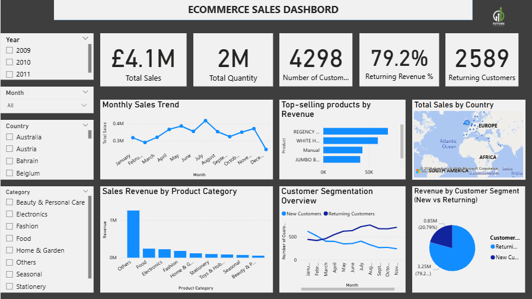

# FUTURE_DS_01
**Ecommerce Sales Analysis: **
Interactive Power BI dashboard analyzing UK-based e-commerce sales (2009–2011). Includes data cleaning, trend analysis, and insights on best-selling products, peak sales periods, revenue by category, and customer behavior to support business decision-making.

## View Dashboard

# Overall Sales Insights (2009–2011)

The business generated **£4.1M in revenue** and sold **2 million units** during the period, with **returning customers contributing 79.2% of total revenue** — indicating strong customer loyalty.  
Sales peaked mid-year and are concentrated in a few high-performing products and categories.

---

## 1. Monthly Sales Trend
- **Insight:** Sales followed a gradual upward trend from February to July, peaking in July.  
  A noticeable drop occurs in December, suggesting **seasonality or end-of-year slowdown**.
- **Recommendation:** Investigate what drives mid-year performance — promotions or seasonal demand.

---

## 2. Top-Selling Products by Revenue
- **Insight:** A few products (like *"Regency Cakestand 3 Tier"*, *"White Hanging Heart T-Light Holder"*, and *"Manual"* products) dominate revenue.  
  Revenue beyond the top 5 drops off sharply, showing **heavy reliance on a small product set**.
- **Recommendation:** Diversify product promotion and boost mid-tier items to reduce risk.

---

## 3. Total Sales by Country
- **Insight:** **Europe is the dominant region** for sales, with pockets in Africa.  
  **Asia shows low or no activity**, as visualized on the map.
- **Recommendation:** Expand marketing or distribution strategies in **underperforming regions**.

---

## 4. Sales Revenue by Product Category
- **Insight:** The "**Others**" category is by far the largest contributor, likely due to **poor product categorization**.  
  Fashion, Food, and Electronics follow at a much lower scale.
- **Recommendation:** Refine product categorization for more actionable insights and boost weaker categories.

---

## 5. Customer Segmentation (Monthly Trends)
- **Insight:** **Returning customers consistently outnumber new customers**, especially from March onward.  
  New customer acquisition is **low and relatively flat**.
- **Recommendation:** Focus on **lead generation and conversion strategies** to grow the customer base.

---

## 6. Revenue by Customer Segment
- **Insight:** Returning customers contribute **£3.25M (79.2%)** of total revenue, while new customers generate **£0.85M (20.8%)**.  
  This indicates **strong retention and repeat purchasing behavior**.
- **Recommendation:** **Leverage loyalty** (e.g., through loyalty programs) but also **invest in new customer acquisition**.

---

## KPI Insights
- **Total Sales:** £4.1M  
- **Total Quantity Sold:** 2 million units  
- **Returning Customer Revenue:** 79.2% of total revenue  
- **Returning Customers:** 2,589 out of 4,298 total customers  

---

## Final Recommendations
1. Boost **new customer acquisition** while maintaining retention.  
2. Balance **revenue reliance** by promoting products beyond the top 5.  
3. Explore **regional growth** opportunities outside Europe.  
4. Personalize campaigns for **returning customers** to drive repeat sales.  
5. Refine **product categorization**, as “Others” is too dominant.

---
